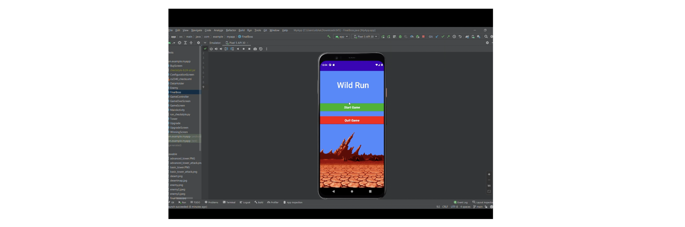
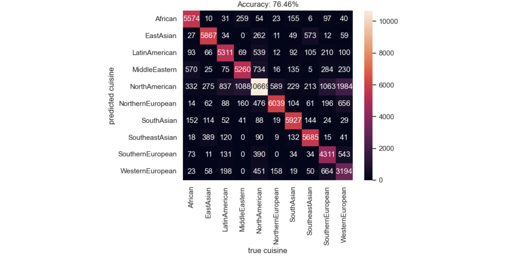
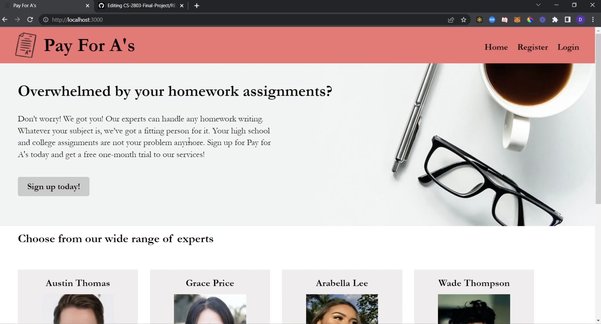

My name is Prisha and I am an undergraduate Computer Science student at the Georgia Institute of Technology specializing in the Intelligence and Information-InterNetworks threads.

For the past decade, I have embarked on an incredible journey of exploration within the realm of Computer Science. Throughout this time, I have actively pursued various opportunities for learning and personal growth in this field. My upbringing in both New Zealand and India has bestowed upon me the invaluable gift of embracing diverse cultures, languages, and ways of life. This exposure not only broadened my perspective but also ignited a deep passion within me for technology and computer science.

In my relentless pursuit of knowledge, I have delved into the intricacies of computer algorithms, continuously striving to understand their inner workings. Additionally, I have sought out opportunities to immerse myself in the rich history and vibrant cultures of different countries. This interdisciplinary approach has nurtured my passion for problem-solving and critical thinking, driving me to integrate creativity and logic into real-life frameworks and principles.

Through my portfolio, I aim to showcase the culmination of my decade-long journey, capturing the essence of my experiences, learnings, and accomplishments. I invite you to join me on this adventure as we explore the intersection of technology, creativity, and innovation.

### Table of Contents:
- [Projects](#projects)
- [Experience](#experience)
- [Leadership, Activities, and Community Service](#lacs)
- [Resume](https://drive.google.com/file/d/1-9-NrvmidCS0tL3XSQh8jV65aWM9kX58/view?usp=sharing)

### **Projects**

- [**Tower Defense Game**](https://youtu.be/NWrtzg3tBDk) 

[Repository Link](https://github.com/prishasheth/Tower-Defense-Game) 
<em>Skills: Mobile Application Development, Android Studio Programming, Graphic Design, Collaboration</em>  
For Georgia Tech's CS2340 class, I created and implemented a tower defense game using Android Studio. The game featured three levels of difficulty, allowing players to choose their preferred level of challenge. To make the gameplay engaging, I implemented enemy attack functionality, where waves of enemies would attempt to reach the player's base and inflict damage. Players had to strategically place towers along the enemy's path to defend their base and prevent the enemies from reaching it. In the game, players had the option to purchase different types of towers with varying abilities and strengths. The interface was designed to be visually appealing and easy to navigate, providing a seamless and enjoyable gaming experience for the players.  

- [**Recipe Generating Machine Learning Model**](https://www.youtube.com/watch?v=vx9jovW9qYw)  
 
[Detailed Project Description](https://github.gatech.edu/pages/khoxha7/CS-4641-Project/final.html) 
[Repository Link](https://github.com/prishasheth/Recipe-Generator) 
<em>Skills: Machine Learning, Neural Nets, LSTM, Naive Bayes, Classifiers</em>  
I trained a machine learning algorithm using LSTM neural networks, Naive Bayes, and other neural net classification algorithms to develop a recipe generating system. The goal of the system was to generate personalized recipes for users based on their favorite foods and the ingredients they had available. I leveraged multiple datasets containing recipe information, including ingredients, cooking methods, and user preferences. By utilizing these datasets, I aimed to enhance the algorithm's accuracy and effectiveness in generating relevant and appealing recipes. I applied techniques such as data preprocessing, feature engineering, and model training to develop a robust recipe generation system. By combining the power of machine learning algorithms and natural language processing, I was able to create a solution that could provide users with personalized recipe recommendations based on their specific tastes and available ingredients.  

<!-- - [**Getting to Know U(Vertically Integrated Project)**]() 

[Repository Link]() 
<em>Skills: </em>  

- [**Getting to Know U(Vertically Integrated Project React App)**]() 

[Repository Link]() 
<em>Skills: </em>   -->

- [**WebDev Project**](https://youtu.be/rTvghR3G-As) 

[Repository Link](https://github.gatech.edu/psheth32/CS-2803-Final-Project) 
<em>Skills: HTML, CSS, Node.js, React, SQL</em>  
I developed a comprehensive website using HTML, CSS, JavaScript, Node.js, and SQL that served as a platform for a Pay-For-A's service. The primary focus of the website was to connect students with tutors whom they could hire for academic assistance. One of the key features of the website was the login and logout functionality, allowing users to securely access their accounts and manage their tutoring sessions. To support the website's functionality, I implemented a robust backend using Node.js. The backend facilitated the interaction between the frontend and the database, allowing seamless communication and data management. It played a vital role in handling user requests, managing session data, and ensuring a smooth user experience. The website also incorporated a payment service. This enabled students to conveniently make payments for the tutoring services they received. The integration of a secure and reliable payment system enhanced the overall user experience and provided a seamless transaction process. To store and manage user data, I utilized SQL, a powerful database management system. By designing and implementing an efficient database schema, I ensured the proper storage and retrieval of user information, tutor profiles, and transaction records.  

- **Game Boy Advance** 
<em>Skills: C, GBA, Graphic Design</em>  
I developed an interactive C program specifically tailored for the Game Boy Advance emulator, demonstrating my expertise in low-level programming with C. This project showcased my ability to work at the hardware level, as I utilized techniques like accessing hard-coded memory addresses to directly interface with the emulator's components. By leveraging such techniques, I created a seamless gaming experience with smooth graphics rendering, responsive input handling, and immersive audio playback. To optimize performance, I employed Direct Memory Access (DMA) to efficiently transfer data between memory sections, ensuring minimal slowdowns and maximizing overall gameplay quality. This project highlighted my proficiency in low-level programming, resource management, and my ability to create engaging experiences within hardware limitations.  

### **Experience**

- **Intel Corporation - Software Engineer Intern**
    - Engineering and developing a Pre-Production Driving Service to emulate the Intel Clients driver upload process to Microsoft, facilitating        the signing of drivers for testing and validation. Implementing functionalities such as obtaining SAS URLs, triggering file uploads, and 
      retrieving signed drivers from the Windows Dev Center.

- **Intel Corporation - Software Design Engineer Intern**
    - Engineered and managed a Web Application, used by the MTC DevOps team to back up source/media files transferred from Microsoft, using the        ASP.NET MVC pattern in C#.
    - Modernized the Dashboard by using technologies such as Figma and Miro to build wire-frames that would facilitate the process of creating         clean, consolidated and refined interfaces.
    - Analyzed the Master MTC DevOps database to extract useful data for the Dashboard by making API calls to the API.
    - Enhanced the page significantly by adding features such as internal path searches and filters to cater to the needs of the user.
      Implemented technologies such as lazy loading to access API data quicker and more efficiently to improve run times.
      
- **College of Computing (Georgia Institute of Technology) - Teaching Assistant**
    - As an undergraduate teaching assistant for the Intro to Discrete Math Computer Science course, my responsibilities included leading weekly recitations, offering three hours of help desk support per week, creating and organizing weekly assignments and solutions, as well as grading examinations.

- **IIT Bombay - Technical Intern**
    - I designed and implemented a comprehensive web page using HTML, JavaScript, and CSS for the Movement Neuroscience and Rehabilitation Technology lab. The aim was to educate viewers about the lab's extensive research in the field of motor control and motor learning. By collating multiple resources and creating a centralized location, the web page provided a one-stop-shop for information. This initiative aimed to increase awareness about the lab's work, leading to more research opportunities and job prospects for students at IIT Bombay. Through an intuitive and user-friendly interface, the web page showcased the lab's achievements, ongoing projects, publications, and collaborations. By presenting this wealth of information in a centralized manner, the web page served as a hub for interested individuals, fostering greater engagement with the lab's research and contributing to the advancement of movement neuroscience and rehabilitation technology.

 - **Motion Drivetronics - Design Intern**
     - In collaboration with the design organization, I utilized AutoCAD and SOLIDWORKS to design stepper motors, synchronous motors, gearheads, and motor parts. Through this process, we achieved significant improvements in motor performance. By employing these advanced design tools, we were able to optimize the motor designs for enhanced efficiency and reliability. As a result, the manufacturing process experienced a remarkable 30% reduction in turnaround time. This improvement enabled faster production and delivery of motors, ultimately benefiting our customers and enhancing overall operational efficiency. By leveraging AutoCAD and SOLIDWORKS, our collaborative efforts successfully resulted in the development of high-quality motor components that contributed to improved performance and streamlined manufacturing processes.
 

### **Leadership, Activities, and Community Service**

 - **Python for Beginners**
I developed and conducted a Python course catered towards beginners, with a focus on reaching out to underrepresented groups in STEM. The course attracted over 50 students, with a majority being female participants. By introducing them to the fundamentals of coding and Python, this initiative aimed to ignite their interest in programming and inspire them to pursue careers in engineering and STEM fields. Through hands-on exercises and interactive sessions, the course empowered these students to develop valuable coding skills and provided them with a strong foundation to further explore the world of programming.

 - **Vice-President of the Student Council**
I actively collaborated with fellow council members and faculty to make informed decisions for our school. By fostering open communication and considering diverse perspectives, we worked towards creating a positive and inclusive environment. Through our collective efforts, we set a strong example through our behavior, adhering to expected norms and promoting discipline and decorum among students. These initiatives significantly contributed to increased student morale, creating a conducive learning atmosphere and enhancing the overall school experience.

 - **Google Developers Student Club**
Actively involved in DSCGT, developing skills through workshops and collaborative projects. Created impactful solutions for local businesses, including data analysis and app development. Strengthened technical expertise, problem-solving, and teamwork in a hands-on, peer-to-peer learning environment.
